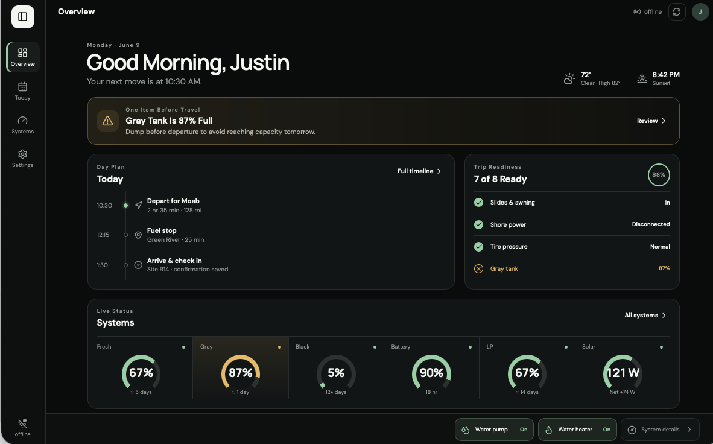
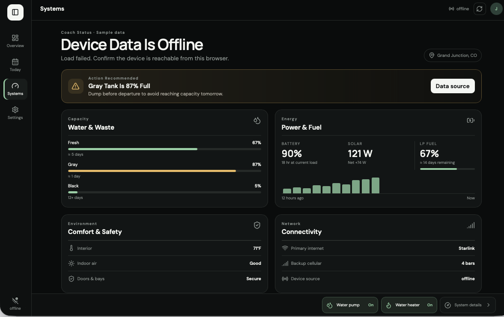
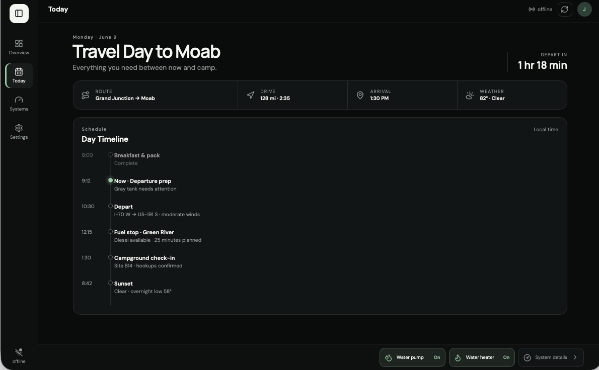

# Coach Overseer dashboard

A responsive Svelte dashboard for a day-at-a-glance view of travel plans, coach readiness, and live system status.

** Note: This is the front for the ESP32 based "Nomad Device Monitor",
[Nomad Device Monitor](https://github.com/Thuetar/Nomad-Device-Monitor)


## Home Screen


## Systems 


## Daily Reminders 


## Configure


## Device data source

Open **Settings → Data Source** in the dashboard and enter the base address of a Nomad Device Monitor, such as `http://tankman.local`. The address and refresh interval are saved in browser storage for that device.

The dashboard reuses the monitor's existing read APIs:

- `GET /api/status`
- `GET /api/tank`
- `GET /api/tank/config`

Until a source is configured, the dashboard keeps its original sample values. When the dashboard itself is served over HTTPS, the configured source must also be reachable over HTTPS because browsers block insecure API requests from secure pages.

## Run locally

```bash
npm install
npm run dev
```

## Production build

```bash
npm run build
```
